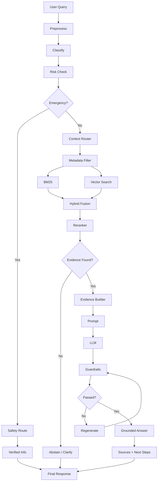

```mermaid
flowchart TD

A["User Query"]
--> B["Preprocess"]
--> C["Classify"]
--> D["Risk Check"]
--> E{"Emergency?"}

E -->|Yes| F["Safety Route"]
F --> G["Verified Info"]
G --> Z["Response"]

E -->|No| H["Context Router"]
H --> I["Metadata Filter"]

I --> J["BM25"]
I --> K["Vector Search"]

J --> L["Hybrid Fusion"]
K --> L

L --> M["Reranker"]
M --> N{"Evidence Found?"}

N -->|No| O["Abstain / Clarify"]
O --> Z

N -->|Yes| P["Evidence Builder"]
P --> Q["Prompt"]
Q --> R["LLM"]
R --> S["Guardrails"]

S --> T{"Passed?"}

T -->|No| U["Regenerate"]
U --> S

T -->|Yes| V["Grounded Answer"]
V --> W["Sources + Next Steps"]
W --> Z["Final Response"]
```
